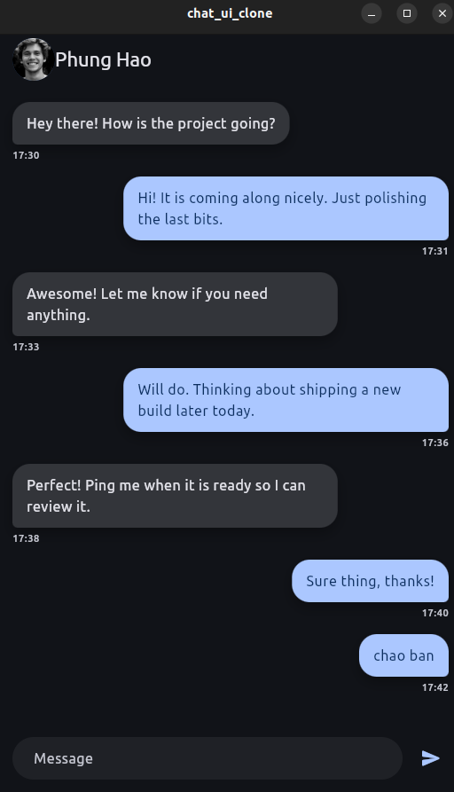

# Chat UI Clone

Dự án Flutter mô phỏng giao diện trò chuyện hiện đại, thích hợp để luyện tập bố cục, màu sắc và quản lý trạng thái đơn giản.

## Tính năng chính
- Khung hội thoại tĩnh được dựng từ dữ liệu mẫu giúp thử nghiệm UI nhanh chóng.
- Bong bóng tin nhắn tái sử dụng cho cả hai chiều gửi/nhận.
- Giao diện phản hồi linh hoạt trên cả màn hình di động lẫn desktop.

## Công nghệ & Widget sử dụng
- `ListView` hiển thị luồng tin nhắn cuộn mượt.
- `Row`, `Column` tổ chức các khối nội dung.
- `Container`, `Padding`, `SizedBox` định dạng không gian, màu nền và khoảng cách.
- `CircleAvatar`, `Icon`, `Text` tạo avatar, biểu tượng và văn bản.

## Bắt đầu nhanh
1. Cài đặt [Flutter SDK](https://docs.flutter.dev/get-started/install) và chạy `flutter doctor` để kiểm tra môi trường.
2. Tải gói phụ thuộc bằng `flutter pub get`.
3. Khởi chạy ứng dụng trên thiết bị hoặc trình giả lập với `flutter run`.

## Cấu trúc thư mục
- `lib/main.dart`: Điểm vào ứng dụng, cấu hình chủ đề và điều hướng.
- `lib/data/mock_messages.dart`: Bộ dữ liệu tin nhắn mẫu cho màn hình chat.
- `lib/screens/chat_screen.dart`: Bố cục và logic hiển thị giao diện trò chuyện.
- `assets/ui.png`: Ảnh chụp màn hình sử dụng trong README.

