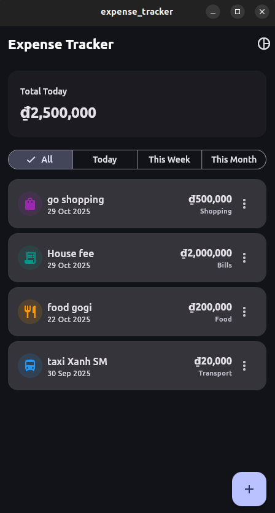
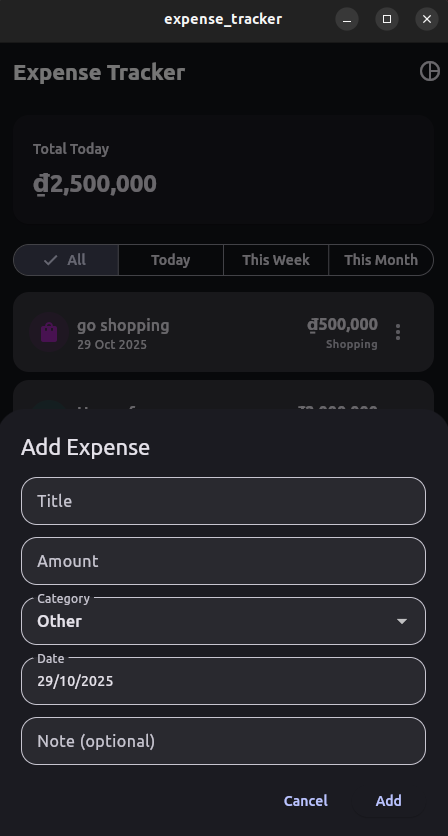
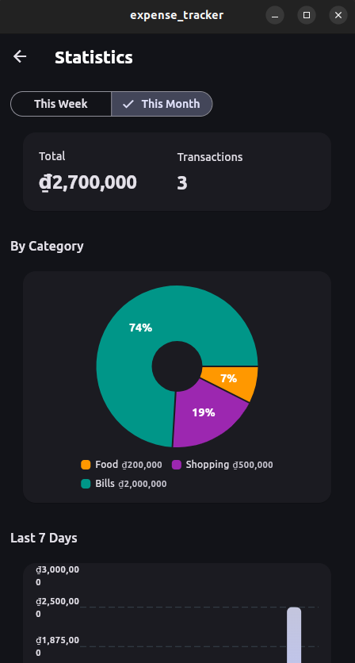
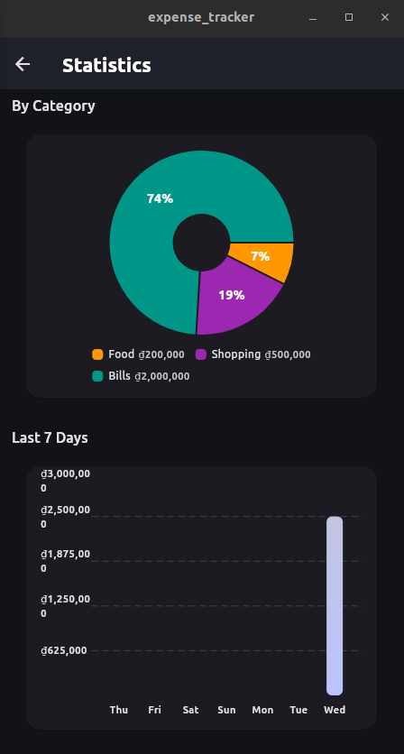

# Expense Tracker

Ứng dụng Flutter theo dõi chi tiêu cá nhân, hỗ trợ lưu trữ ngoại tuyến và trực quan hóa dữ liệu chi tiêu theo thời gian.

## Tính năng chính
- Ghi nhận, chỉnh sửa và xoá giao dịch với các danh mục tuỳ chỉnh.
- Lọc danh sách chi tiêu theo Ngày, Tuần, Tháng hoặc toàn bộ lịch sử.
- Thống kê tổng chi, số giao dịch và biểu đồ xu hướng 7 ngày gần nhất.
- Giao diện sáng/tối sẵn có, hỗ trợ kéo để làm mới dữ liệu.

## Công nghệ sử dụng
- `Flutter`: xây dựng giao diện đa nền tảng.
- `Hive` + `hive_flutter`: lưu trữ dữ liệu chi tiêu ngoại tuyến dưới dạng key-value boxes, không cần backend.
- `fl_chart`: hiển thị biểu đồ cột 7 ngày và biểu đồ tròn theo danh mục.

## Cấu trúc thư mục
- `lib/models`: định nghĩa model `Expense`, `Category` và adapter cho Hive.
- `lib/repositories`: lớp `ExpenseRepository` xử lý truy vấn, thống kê và series dữ liệu 7 ngày.
- `lib/screens`: màn hình chính và màn hình thống kê.
- `lib/widgets`: các widget tái sử dụng, bao gồm form nhập chi tiêu và các biểu đồ sử dụng `fl_chart`.
- `assets`: hình ảnh giao diện mẫu dùng trong tài liệu giới thiệu.

## Ảnh giao diện

## Hướng dẫn khởi chạy
1. Cài đặt Flutter SDK và cấu hình thiết bị giả lập hoặc thiết bị thật.
2. Cài đặt dependencies: `flutter pub get`.
3. Chạy ứng dụng: `flutter run`.
4. Lần đầu chạy, Hive sẽ tự động khởi tạo box trong thư mục ứng dụng và lưu dữ liệu mẫu (nếu có).
