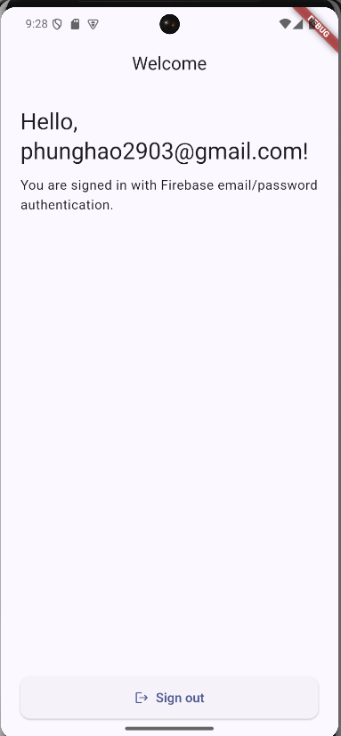

# Ứng dụng Đăng nhập Firebase

Ứng dụng Flutter minh họa luồng đăng nhập bằng Firebase Authentication với cập nhật giao diện theo thời gian thực dựa trên trạng thái người dùng.

## Công nghệ sử dụng
- `firebase_core`: khởi tạo và cấu hình Firebase cho ứng dụng Flutter.
- `firebase_auth`: xử lý đăng ký, đăng nhập, đăng xuất và lấy thông tin người dùng.
- `StreamBuilder`: lắng nghe thay đổi trạng thái đăng nhập để điều hướng giữa màn hình đăng nhập và màn hình chính.


## Tài nguyên

- Giao diện màn hình chính:  
  
- Màn hình đăng nhập:  
  
- Luồng đăng nhập thành công:  
  
- Firebase:  
  

## Cấu trúc chính
- `lib/main.dart`: khởi tạo Firebase, thiết lập `StreamBuilder` cho trạng thái xác thực và điều hướng màn hình.
- `lib/services/firebase_auth_service.dart`: đóng gói các thao tác với `firebase_auth`.
- `assets/`: chứa hình ảnh sử dụng trong README và giao diện.

## Bắt đầu
1. Cài đặt dependencies:
   ```bash
   flutter pub get
   ```
2. Cấu hình Firebase cho từng nền tảng bằng cách thêm tệp cấu hình (`google-services.json`, `GoogleService-Info.plist`, v.v.).
3. Chạy ứng dụng:
   ```bash
   flutter run
   ```
