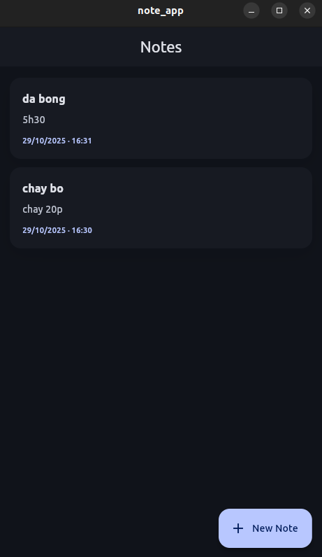
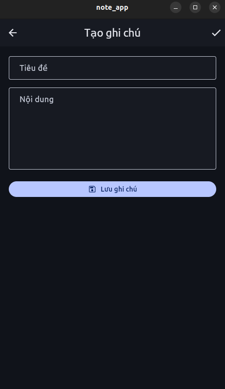

# Note App

Ứng dụng ghi chú đơn giản được xây dựng với Flutter, hỗ trợ tạo, cập nhật và xóa ghi chú ngay trên thiết bị.

## Tính năng
- Tạo ghi chú mới với tiêu đề và nội dung
- Cập nhật hoặc xóa ghi chú đã có
- Danh sách hiển thị ngay khi mở ứng dụng nhờ lưu trữ cục bộ

## Công nghệ sử dụng
- `Provider` và `ChangeNotifier` cho state management
- `TextField` để nhập tiêu đề và nội dung ghi chú
- `FloatingActionButton` cho hành động tạo và lưu nhanh

## Giao diện

## Bắt đầu
1. Cài đặt [Flutter](https://docs.flutter.dev/get-started/install).
2. Chạy `flutter pub get` để tải các gói phụ thuộc.
3. Khởi động ứng dụng bằng `flutter run`.

