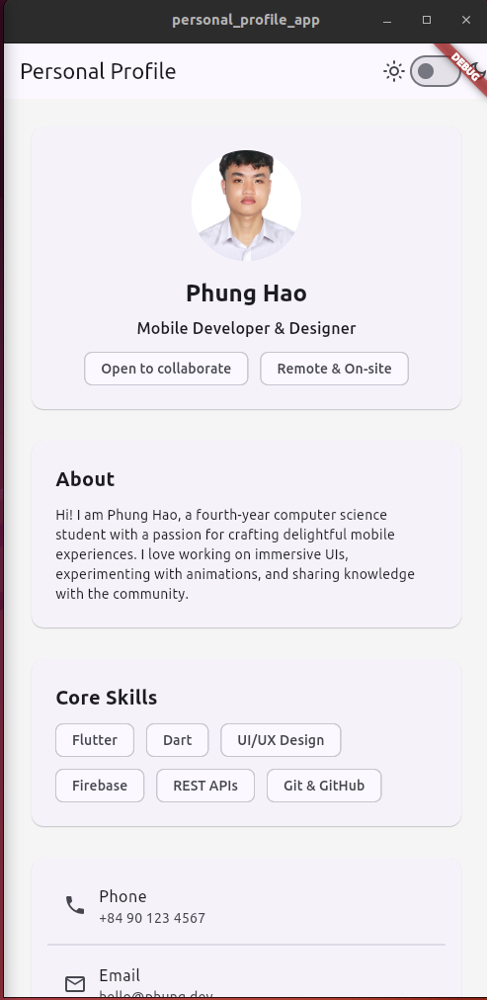
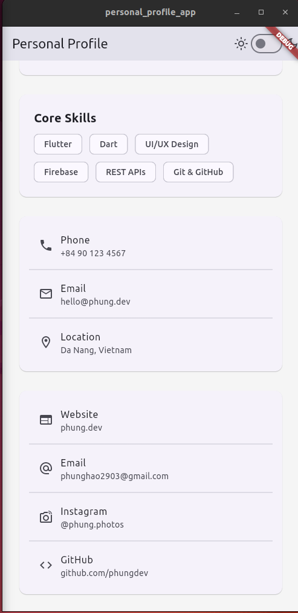
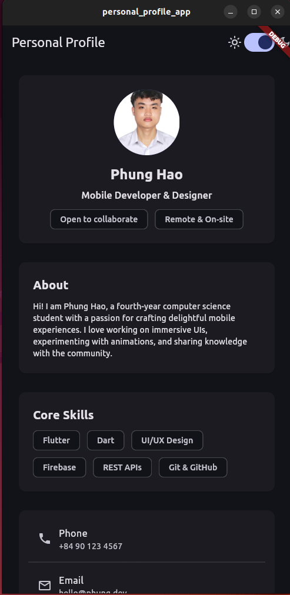

# Ứng dụng Hồ sơ Cá nhân

Ứng dụng Flutter giới thiệu thông tin cá nhân, kỹ năng, liên hệ và mạng xã hội với giao diện thích ứng từ điện thoại đến máy tính bảng, kèm công tắc chuyển nhanh giữa chế độ sáng và tối.

## Tính năng
- Bố cục hai cột trên màn hình rộng, tự động xếp dọc trên thiết bị di động
- Thẻ thông tin cho phần giới thiệu, kỹ năng, liên hệ và mạng xã hội
- Công tắc dark mode sử dụng `ThemeMode`
- Phần đầu có `CircleAvatar` hiển thị ảnh/initials gọn gàng
- Xây dựng hoàn toàn bằng các widget Flutter cơ bản (`Column`, `Card`, `ListTile`, `CircleAvatar`, `Wrap`)

## Bắt đầu
1. Cài đặt Flutter (khuyến nghị 3.19 trở lên).
2. Tải dependencies:
   ```bash
   flutter pub get
   ```
3. Chạy ứng dụng trên thiết bị hoặc giả lập:
   ```bash
   flutter run
   ```

## Cấu trúc dự án
- `lib/main.dart` chứa toàn bộ giao diện và logic chủ đề.
- `assets/3x4.jpg` là ảnh hồ sơ mẫu.
- `assets/UI/` lưu ảnh chụp màn hình tham khảo.

## Ảnh giao diện




## Gợi ý tùy chỉnh
- Thay thông tin liên hệ, mạng xã hội và danh sách kỹ năng trong `lib/main.dart`.
- Thêm ảnh chân dung thật vào `assets/` rồi cập nhật `_ProfileCard`.
- Chỉnh `seedColor` trong theme để đồng bộ màu sắc thương hiệu cá nhân.
