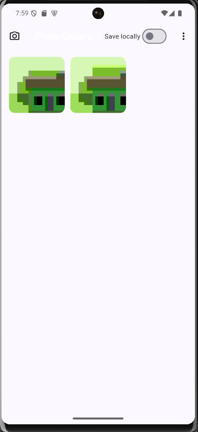

# Ứng dụng Photo Gallery

Ứng dụng Flutter cho phép người dùng chọn hoặc chụp ảnh để hiển thị trong thư viện nhỏ, đồng thời lưu tạm ảnh trong bộ nhớ cục bộ của thiết bị.

## Công nghệ và thư viện sử dụng
- `image_picker`: truy cập camera hoặc thư viện ảnh để lấy hình ảnh mới.
- `permission_handler`: xin quyền camera và quyền truy cập ảnh theo từng nền tảng.
- `GridView`: trình bày bộ sưu tập ảnh theo dạng lưới, hỗ trợ cuộn mượt.
- Lưu trữ cục bộ (tuỳ chọn): ảnh đã chọn có thể được lưu vào bộ nhớ tạm để tái sử dụng khi khởi động lại ứng dụng.

## Cấu trúc chính
- `lib/main.dart`: điểm khởi động ứng dụng, cấu hình theme và điều hướng tới màn hình thư viện.
- `lib/screens/gallery_screen.dart`: giao diện chính hiển thị danh sách ảnh và các nút thao tác.
- `lib/services/photo_picker.dart`: bao bọc `image_picker` để chụp ảnh hoặc lấy ảnh từ thư viện.
- `lib/services/permissions_service.dart`: xử lý cấp quyền thông qua `permission_handler`.
- `lib/widgets/`: các widget con như nút bật tắt lưu trữ, thẻ ảnh, v.v.

## Ảnh minh hoạ

## Lưu ý
- Khi chạy trên Android 13+, đảm bảo manifest có quyền `READ_MEDIA_IMAGES` và quyền camera.
- Trên emulator Android mặc định, camera là nguồn giả lập; để dùng webcam thật cần cấu hình lại AVD hoặc chạy trên thiết bị thật.
## Chạy dự án
1. Cài đặt Flutter và các công cụ phụ trợ (Android Studio/Xcode).
2. Chạy `flutter pub get` để tải các gói phụ thuộc.
3. Khởi động thiết bị giả lập hoặc kết nối thiết bị thật.
4. Thực thi `flutter run` để build và chạy ứng dụng.