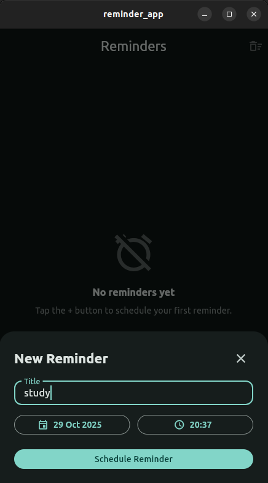
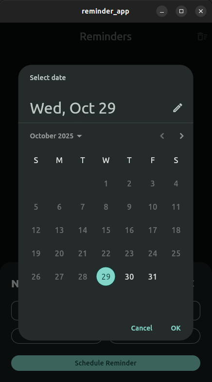
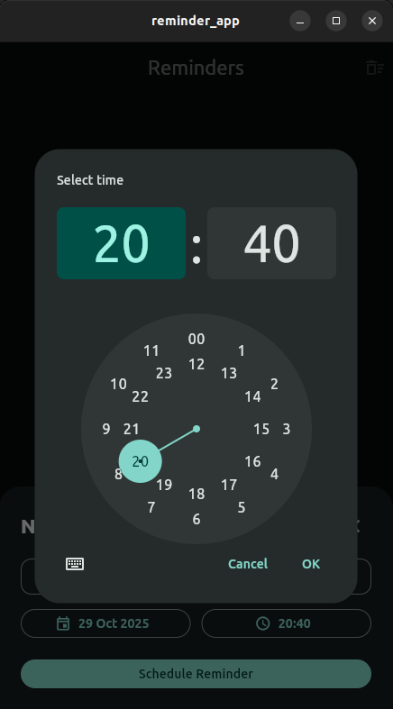

# Reminder App

Ứng dụng Flutter đơn giản giúp bạn tạo và quản lý các lời nhắc (reminder).

## Công nghệ sử dụng

- `flutter_local_notifications` để hiển thị và lên lịch thông báo cục bộ, có hỗ trợ lịch theo múi giờ (`zonedSchedule`).
- Bổ sung các lời nhắc bằng `showDatePicker` và `showTimePicker` cho phép người dùng chọn ngày và giờ thân thiện.
- Hỗ trợ xử lý bất đồng bộ với `Future`, kết hợp với các trigger chạy nền để đặt lịch thông báo ở thời điểm mong muốn.
- `timezone` và `flutter_native_timezone_updated_gradle` giúp ánh xạ thời gian thực theo múi giờ của thiết bị.

## Giao diện

