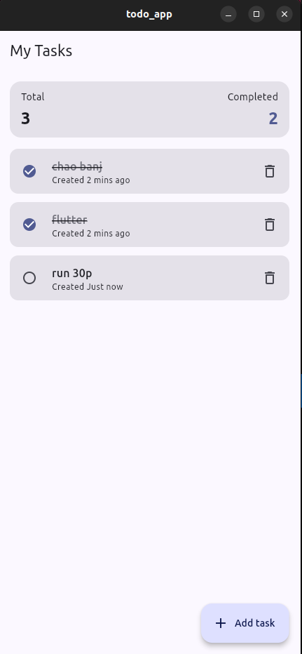
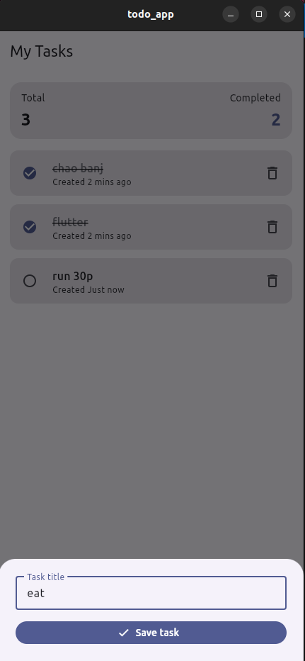

# 📱 Todo App (Local State)

Ứng dụng Flutter quản lý danh sách công việc hoạt động hoàn toàn ngoại tuyến. Bạn có thể thêm, đánh dấu hoàn thành, xóa và lưu trạng thái công việc ngay trên thiết bị nhờ `SharedPreferences`.

## ✨ Tính năng chính
- Thêm công việc mới bằng hộp thoại nhập liệu tiện lợi.
- Đánh dấu hoàn thành bằng checkbox và theo dõi số lượng hoàn tất.
- Vuốt sang trái để xóa công việc và hiển thị thông báo hoàn tác.
- Tự động lưu trữ dữ liệu cục bộ bằng `SharedPreferences`.
- Giao diện hiện đại sử dụng Material 3.

## 🛠️ Công nghệ & kiến trúc
- Flutter + Dart (Material 3, `StatefulWidget`, `ListView.builder`, `setState`).
- Lưu trữ local bằng `shared_preferences`.
- Mock `SharedPreferences`.

## 🚀 Bắt đầu
### Yêu cầu
- Flutter SDK (`>=3.9.2`)
- Dart SDK tương thích (đi kèm Flutter)

### Cài đặt
```bash
flutter pub get
```

### Chạy ứng dụng
```bash
flutter run
```

### Kiểm thử
```bash
flutter test
```

## 🗂️ Cấu trúc thư mục chính
- `lib/main.dart`: Toàn bộ logic UI & xử lý Todo (thêm, sửa trạng thái, xóa, lưu trữ).
- `assets/`: Hình ảnh UI dùng cho tài liệu.


## 🖼️ Giao diện minh họa
| Màn hình danh sách | Thêm công việc |
| --- | --- |
|  |  |


