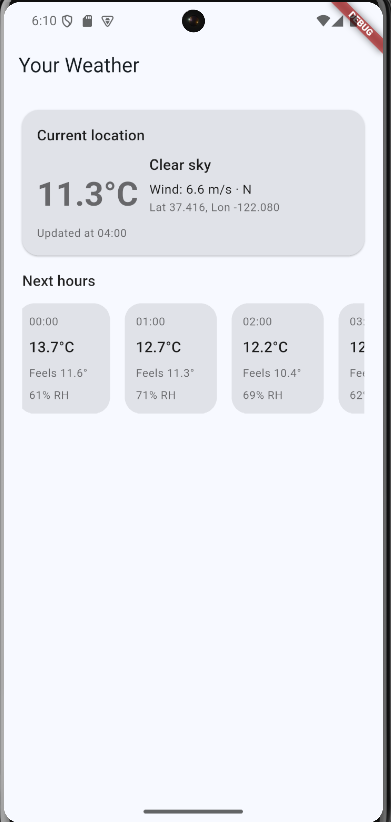

# Weather App



Ứng dụng Flutter nhỏ giúp lấy vị trí người dùng để hiển thị thời tiết hiện tại và dự báo 12 giờ kế tiếp. Dự án minh họa cách xin quyền truy cập vị trí, gọi REST API và tổ chức widget gọn gàng.

## Tính năng
- Lấy toạ độ hiện tại bằng `geolocator`, xử lý đầy đủ các trường hợp thiếu quyền hoặc tắt dịch vụ vị trí.
- Gọi Open-Meteo REST API thông qua gói `http`.
- Phân tích JSON thành các model Dart (`Weather`, `HourlyPoint`) để dễ xử lý.
- Sử dụng `FutureBuilder` và `RefreshIndicator` để quản lý trạng thái tải dữ liệu, thành công và lỗi.
- Hiển thị nhiệt độ hiện tại, hướng/gió và dải dữ liệu 12 giờ sắp tới bằng các widget tuỳ chỉnh.

## Công nghệ & Thư viện
- Flutter 3, Material 3 theme.
- `geolocator` – truy xuất vị trí GPS.
- `http` – gửi yêu cầu HTTP.
- `FutureBuilder`, `RefreshIndicator` – cập nhật UI bất đồng bộ.
- `dart:convert` – giải mã JSON tiêu chuẩn.

## Khởi chạy dự án

```sh
flutter pub get
flutter run
```

> **Lưu ý:** Chức năng tự động lấy vị trí hiện hỗ trợ Android, iOS, macOS, Windows và Web. Bản Linux sẽ thông báo lỗi kèm hướng dẫn.

## Cấu trúc thư mục
- `lib/main.dart` – Điểm khởi động app, cấu hình theme.
- `lib/screens/weather_screen.dart` – Màn hình chính cùng xử lý trạng thái tải.
- `lib/services/` – Dịch vụ geolocator và client gọi Weather API.
- `lib/widgets/` – Các widget trình bày có thể tái dùng.
