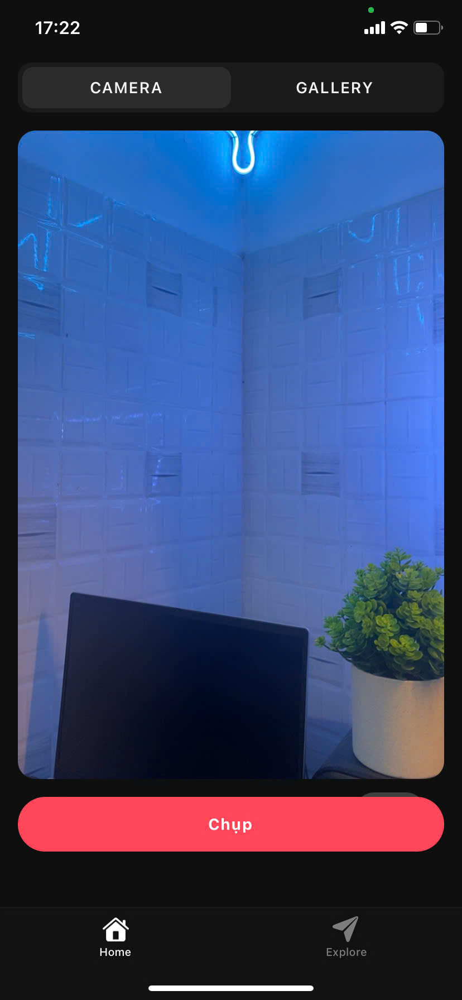
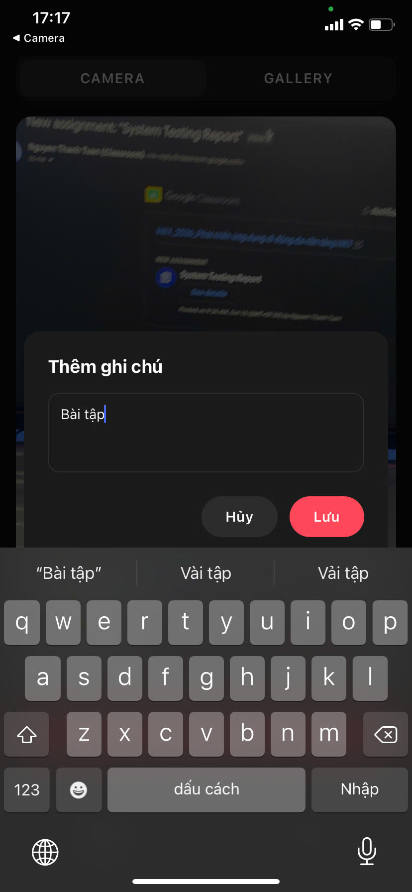
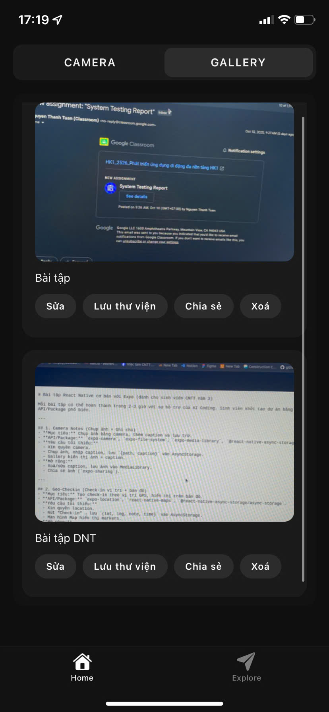
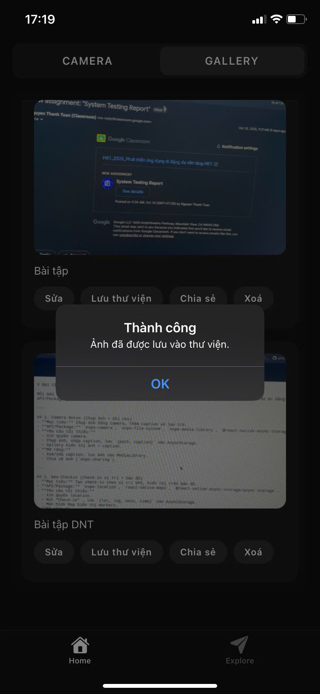
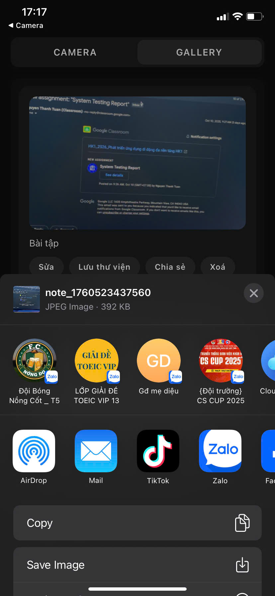

# 📸 Camera Notes (Expo + React Native)

Ứng dụng di động cho phép **chụp ảnh**, **thêm caption (ghi chú)** và **lưu trữ cục bộ**.  
Có 2 tab chính:
- **Camera:** chụp ảnh bằng camera của thiết bị.  
- **Gallery:** xem ảnh đã lưu, sửa/xoá caption, lưu vào thư viện ảnh hoặc chia sẻ.

> ✅ Dự án hoàn thành đầy đủ yêu cầu của đề tài **“Camera Notes (Chụp ảnh + Ghi chú)”**

---

## 🧩 Giới thiệu nhanh

<p align="center">

  
  
  
  
  
  
</p>

---

## ✨ Tính năng

### 🧱 Yêu cầu tối thiểu
- ✅ Xin quyền **Camera** (và **Media Library** nếu cần).  
- ✅ **Chụp ảnh** bằng `expo-camera`.  
- ✅ **Nhập caption** (ghi chú) cho mỗi ảnh.  
- ✅ **Lưu dữ liệu `{uri, caption}`** vào **AsyncStorage** (`@react-native-async-storage/async-storage`).  
- ✅ **Gallery** hiển thị danh sách ảnh + caption.

### ⚡ Mở rộng đã thực hiện
- ✅ **Sửa caption** của ảnh.  
- ✅ **Xoá ảnh** khỏi bộ nhớ tạm + AsyncStorage.  
- ✅ **Lưu ảnh vào MediaLibrary** (`expo-media-library`).  
- ✅ **Chia sẻ ảnh** qua các ứng dụng khác (`expo-sharing`).  
- ✅ Giao diện **UI tối giản, hỗ trợ dark mode**, không crash khi từ chối quyền.  
- ✅ Hiển thị thông báo lỗi, loading và xác nhận người dùng.

---

## 🧰 Công nghệ & Gói sử dụng

| Thành phần | Mô tả |
|-------------|--------|
| **Expo / React Native** | Nền tảng phát triển ứng dụng |
| `expo-camera` | Chụp ảnh |
| `expo-file-system` | Quản lý file cục bộ (dùng `expo-file-system/legacy`) |
| `expo-media-library` | Lưu ảnh vào thư viện thiết bị |
| `expo-sharing` | Chia sẻ ảnh ra bên ngoài |
| `@react-native-async-storage/async-storage` | Lưu metadata `{uri, caption}` |
| `react-native-safe-area-context` | Xử lý vùng an toàn UI |

---

## 📦 Cài đặt & Chạy ứng dụng

```bash
# 1️⃣ Cài đặt phụ thuộc
npm install

# 2️⃣ Cài các gói Expo cần thiết
npx expo install expo-camera expo-media-library expo-file-system expo-sharing @react-native-async-storage/async-storage react-native-safe-area-context

# 3️⃣ Chạy ứng dụng
npx expo start
# Nếu lỗi mạng LAN, dùng:
npx expo start --tunnel -c

