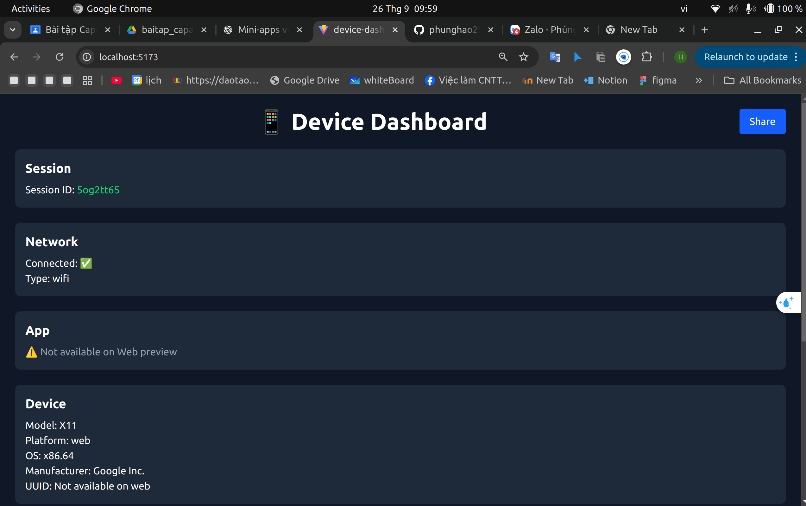
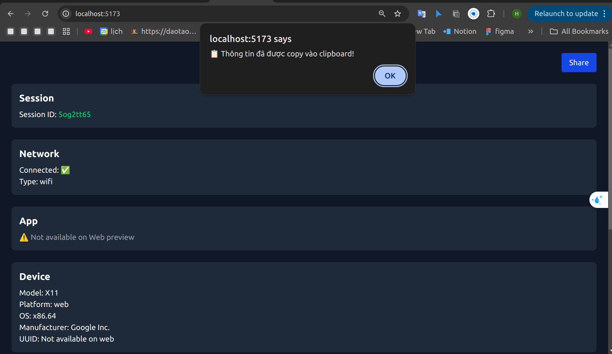

# 📱 Bài tập 5 – Device Dashboard (Capacitor App)

## 🎯 Mục tiêu
Xây dựng ứng dụng cross-platform bằng **Vite + React + Capacitor**, hiển thị thông tin thiết bị & ứng dụng.

---

## 🔌 Plugins sử dụng
- `@capacitor/device` → Lấy thông tin thiết bị (Model, OS, Manufacturer, UUID).
- `@capacitor/network` → Kiểm tra trạng thái mạng và lắng nghe thay đổi.
- `@capacitor/app` → Lấy thông tin ứng dụng (Tên, phiên bản).
- `@capacitor/share` → Chia sẻ thông tin (chức năng mở rộng).

---
## 📸 Screenshot

 
 

## ✅ Yêu cầu đã hoàn thành

### Yêu cầu tối thiểu
-  Hiển thị **Model, OS, phiên bản app**.  
-  Hiển thị **trạng thái mạng hiện tại**.  
-  Sinh **ID ngẫu nhiên cho phiên** khi app mở.  

### Mở rộng
-  **Cập nhật realtime** khi trạng thái mạng thay đổi (WiFi/4G/Offline).  
-  **Chia sẻ thông tin bằng Share** (mở share sheet của Android/iOS).  

---

## ▶️ Cách chạy

### 1. Web
```bash
npm install
npm run dev

